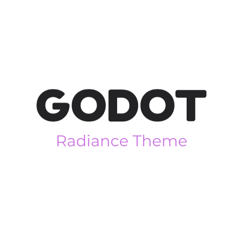

# Godot Radiance Theme

   

A modern color theme for the Godot 4 text editor (recommended for Godot 4.6+), inspired by the [Moonlight II Theme](https://github.com/atomiks/moonlight-vscode-theme) for Visual Studio Code.

## Variants

Currently available theme variants:

- Radiance Dark
- Radiance Midnight
- Radiance Light

## Setup

### Adding the Text Editor Themes

Download the `.tet` files and place them in your Godot text editor theme directory:

- **Windows:** `%APPDATA%\Godot\text_editor_themes\` 
- **macOS:** `~/Library/Application Support/Godot/text_editor_themes/`
- **Linux:** `~/.config/godot/text_editor_themes/`
- **Steam:** `steamapps/common/Godot Engine/editor_data/text_editor_themes/`

Open any project and navigate to:

`Editor > Editor Settings > Text Editor > Theme`

Select your preferred theme from the Color Theme dropdown.

### Recommended Fonts

Any font will do but we recommend [DM Sans](https://fonts.google.com/specimen/DM+Sans) and [DM Mono](https://fonts.google.com/specimen/DM+Mono). Download the fonts and and place the `.ttf` files in a folder of your choice.

Go to:

`Editor > Editor Settings > Interface > Editor`

Set:
- **Main Font:** `{path_to}/DMSans-Regular.ttf`
- **Main Font Bold:** `{path_to}/DMSans-Medium.ttf`
- **Code Font:** `{path_to}/DMMono-Regular.ttf`

## Editor Theme Configuration
Open a project in Godot and go to 

`Editor > Editor Settings > Interface > Theme`

Apply the following settings.

### General Setting
- **Accent Color:** `#9a53d0`
- **Icon Saturation:** `2.0`

### Theme Specific Settings:

#### Radiance Dark
- **Base Color:** `#1b181b`
- **Contrast**: `0.2`

#### Radiance Midnight
- **Base Color:** `#1d1e2c`
- **Contrast**: `0.2`

#### Radiance Light
- **Base Color:** `#edeaed`
- **Contrast**: `0.05`
